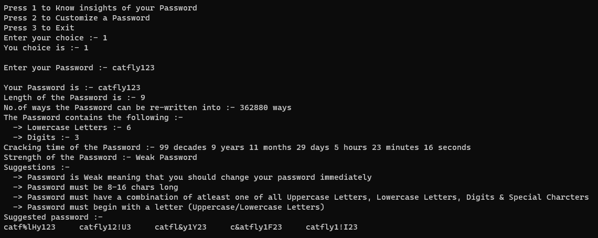

# Password-Suggestion-and-Crack
An interactive C++ console tool that evaluates a password’s composition, estimates naive brute‑force crack time, and suggests stronger variants. 
The estimate assumes offline guessing at high rates, so strong 8–10 character mixed passwords may show durations in years or decades by design.

## Features
Composition breakdown: counts uppercase, lowercase, digits, and special characters.
Naive crack‑time estimate for educational purposes (offline brute force).
Password suggestions that insert missing character classes and pad to minimum length.
Ready‑to‑run VS Code tasks and launch configs in .vscode/.

## Demo


## Set up
_Windows (MinGW‑w64 / MSYS2)_

Install MSYS2 MinGW‑w64 toolchain (g++, gdb).

Open this folder in VS Code.

### Build and run:

Using VS Code: 

F5 (uses .vscode/tasks.json and .vscode/launch.json).

Using terminal:
```
g++ -std=c++17 -O2 Password_Suggestion_and_Cracking.cpp -o password_tool.exe
```
```
.\password_tool.exe
```
<br>

_Linux/macOS (Clang or GCC)_

```
g++ -std=c++17 -O2 Password_Suggestion_and_Cracking.cpp -o password_tool
```
```
./password_tool
```

## What the estimate means
Search space: computed from the union of character classes detected (e.g., if lowercase+digits are present, base ≈ 26 + 10).

Crack rate: represents a high offline brute‑force throughput; online systems often throttle heavily.

Scope: educational estimator, not a forensic password audit; different hashes, salts, GPUs, and rate limits can change results by many orders of magnitude.

## Notes
Estimates can be extremely large for strong passwords; that’s expected with high offline guess rates.

Online authentication targets impose rate limits and lockouts; this tool does not model such controls
